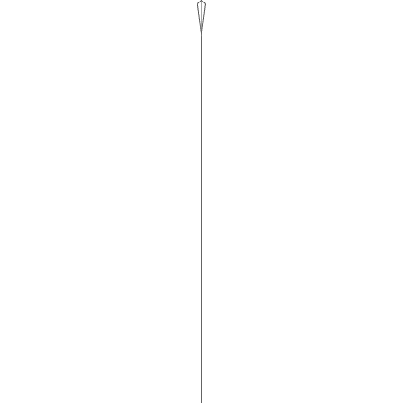

# Leaf Morphology

## Intro

I want to make biologically plausible images of the leaves of imaginary tree species. If that sounds exciting to you, then stick tight because that's what we're going to do. Procedural generation of trees is a relatively common thing but it typically involves decorating the trees with leaves that are either designed by a human artist and only placed by the procedural system or are very simple. I want leaves that have interesting diversity and are recongizable as belonging to a particular species which is itself procedurally generated. In order to do that I need a system for procedurally generating non-trivial leaves. I'm going to do it by implementing a simulation of leaf morphogenesis based on [this paper](http://algorithmicbotany.org/papers/leaves.nph.2017.pdf).

### What is morphogenesis
Morphogenesis is the creation of shape. It refers to the processes by which shape emerges from some growth process, not always but usually biological. The way in which an undifferentiated ball of embryonic cells grows into the very particular shape of a kitten is morphogenesis. In this project we will be looking at the morphogenetic process by which a bulb of meristem (roughly, the plant equivelent of stem tissue in animals) grows into a leaf that has a complex shape specific to the plant's species. We'll take that process and turn in into a system for procedurally generating species specific leaves.

### What is procedural generation
In a typical artistic process an artist will go through some process, whether that be preparing and manipulating clay or painting pixels in a digital image, with the goal of producing some final outcome, a work of art. In procedural generation the artist, rather than engaging in a process to design a final artistic object, designs the process by which artistic objects can be created. That movement from the object as the final project to the process as the final product is the key characteristic of procedural generation and gives it both it's strengths and weaknesses. The strength of the approach lies in it's ability to work with levels of detail and at scales that human artists would struggle with. A human couldn't individually sculpt every leaf in a forest in an entire lifetime but a procedural system could do it in seconds. Even an artist with a deep knowledge of biology would struggle to keep in mind the effects of hormone trasport through a plant's tissues as they sketched, but those kinds of details are well within the capabilities of a procedural system. On the flip side it is very difficult for a procedural system to have even a crude awareness of the aesthetic impact of the work it produces where a human artist can judge and react emotionally to every detail of a work as it is produced. The procedural systems must be painstakingly designed to limit their ability to make non-aesthetic choices which often also limits the overall diversity and interest of their output. This system will play to the strength of procedural generation while stearing away from it's weaknesses by simulating in some detail a system which in the real world reliably produces objects which humans find beautiful and interesting, the leaves of plants.

## Expectations/Outline

I will begin by discussing the model the paper proposes and then move to implementing it as a Rust library suitable for use in games or art projects. I'm using Rust both because it's a language well adapted to these kinds of projects and because I intend to use the library myself for a project which is already written in Rust. I'll be focusing as much on the process of writing a casual (ie. artistic rather than scientific) adaptation of a scientific model because I... I don't know why. Just because.

The paper does include [code](http://algorithmicbotany.org/papers/Leaves2017/index.html) for the author's own implementation. That's super awesome and more scientists should do it. I'm going to ignore the code for now though. I want to implement it myself because I think it will be fun. Also the code from the paper is in C++ that's specific to a [modeling tool](http://www.algorithmicbotany.org/virtual_laboratory/) which is neat but not something I can embed into my project so I need to be independent of it. There may be things that I can't figure out from the description in the paper along in which case I'll be super glad to have that code to look at.

## Overview of the paper

What are leaves? If you look at a leaf it seems to have two main parts. There's a branching structure of veins which start at the main stem (the "petiole" if you want to get fancy) and spread out to the edges of the leaf. Then there's the tissue in between the veins (the lamina) which forms a flat sheet (I know it's not always flat but the paper pretends it is and I'm going to as well (though 3d buckling or the shapes of succulent leaves would be a super neat enhancement to figure out in the future). There's a lot else going on but that's enough to start with, a tree of veins embeded in a sheet of tissue. Leaves start out as little bulbs of tissue on a branch, I'm actually not sure what early growth is like at all but eventually you get the begining of that vein structure and after that the veins grow longer and occasionally branch and the lamina grows along with it such that there is always some lamina out to the very tips of the veins. There doesn't seem to be concensous about exactly how or why the parts grow the way they do but that's not super imortant for this high level model, we just want to get the crude process about right.

The paper's model breaks the leaf down into three distinct parts. The first is a triangle mesh which represents the lamina. The other two are the veins and the outermost edge of the leaf which turns out to be a key component of their model. Both are embeded in the lamina mesh.

***
**What is a triangle mesh**
Triangle meshes are a common structure in grahics software or other places where there's a need to represent 2d or 3d shapes but if you haven't worked in those domains they might be unfamiliar so I'll introduce them here. We're likely to be using them a lot.

_illustration of a triangle mesh_

A triangle mesh consists of two things: points in space (two dimensional space in our case) and connections between those points such that if you drew a line between each connected point you'd end up with a bunch of triangles, each sharing edges with three neighboors unless it's on the edge of the mesh.

_example of a triangle mesh structure in Rust_

***

The leaf margin is the outermost edge of the lamina mesh and it's vertices are annotated with morphogens (discussed below). The veins run along edges of the lamina mesh and are all internal except the base of thepietole and the tip of each vein which end at one of the margin vertices. The vertices where a joins the margin are important to the model and are called convergence points in the paper. The rest of the mesh is unlabeled and mostly passive in the model but will be important when we render the leaf models into images.

My impulse is to store all that in a single mesh structure though it may end up being convenient to have the veins as a seperate component. We'll see what operations we really need to do on the structures, that will guide how we represent them.

The morphogens that exist in the leaf margin represent the present of growth hormones or other processes (it's vague) in the plant that control some aspects of growth. Right now all we need to know that there are some number of these morphogens which can exists at a vertex. I think they're boolean, just presence or absence, but we might need a number to store an amount.

So the model's data lives in a labeled mesh, what are the processes that will use that structure. There are three main process: vein elongation, vein division and lamina growth.

Vein growth is fairly simple. The veins consist of segments end to end. They can grow both by adding more segments at the tip or by elongating existing segments. Various aspects of the model effect which kind of growth happens at any given time, more below. When a segment elongates it pushes segments beyond it outward. It also pulls the margin near it's tip outward with it.

Vein division is controlled by the length of the margin between the tips of two existing veins. Once that length exceeds some threshold a new vein tip is added at the midpoint of that margin section and connected to some point on an existing vein. The paper proposes several mechanisms for choosing the attachment point and I honestly can't remember which one they actually use without going back and looking. Basically you connect it to the closest point on an existing vein.

Lamina growth is conceptually simple but harder to implement and I don't actually understand how to do it yet, that'll be a thing to figure out and may end up being the hardest part of this project. The basic idea is that the lamina grows continually and uniformly in all directions which creates stresses within the leaf that cause it to distort. If we were doing 3d this is where buckling would come in. In the 2d model I think it only effects how deep the curves between vein tips end up being but it may change vein orientation as well, I'm not sure.. So, a lot more on this later.

There are at least two important parameters which effect these growth processes. One is the presence of morphogens. These represent growth regulation systems in the leaf, maybe growth hormonse but maybe other things. I don't believe the paper suggests that their morphogen model reproduces an actual mechanism in real plants, but it approximates the effects of those systems on leaf shape. In the model morphogens are boolean flags attached to the vertices at the leaf margin. They seem to be able to produce arbitrary effects on the leaf. In the paper I've so far seen examples of morphogens that control the margin length threshold for vein branching, either making it shorter or longer, possibly supressing branching entirly in the region of the leaf they effect. There also seems to be one that supresses lamina growth. There may be others or I may not fully understand how those examples actually work. Morphogens are distributed over the leaf margin when the model is initialized and then basically just stick to vertices as they move due to growth. When more vertices are added to the margin they seem to inherit the morphogens from their neighboors. Something more complex happens when a new vein tip is added, I'm not totally sure how that works yet but it seems to split contiguous regions of morphogens in half. The other important parameter controls vein segment elongation. In some species elongation only happens near the base of the leaf and that's important in forming certain leaf shapes. I believe that even in those cases new segments still grow at the tip of the veins.

Ok. I think that covers the broad strokes of the model. There are a lot of details to fill in but we've got enough to start sketching some code.

## Basic Structures

Data structures first:

```rust
#[derive(Copy, Clone, Debug)]
pub struct Morphogens;
type Point = [f32; 2];
```

I don't really know how to represent morphogens yet. They're probably a bitfield or the moral equivelant of that. I'm going to punt for now and just make a unit struct stub so that I have something to stick in other structures. It's possible that I should use a linear algebra crate and it's point types but I don't think I'm going to need it so I'm going to go with the simpelest possible point representation for now. I may have to back out of this decision later.

```rust
#[derive(Copy, Clone, Debug)]
pub enum Vertex {
    Lamina(Point),
    Margin(Point, Morphogens),
    Vein(Point),
}
 ```
 
 I know that I have three classes of things tied to my triangle mesh and that any point in the mesh can only belong to one class so I think representing vertex data with an enum is right. I may neeed to cram more data into the Vein variant since veins have a directionality, each vein vertex has a base-ward and a tip-ward (basipetal and acropetal for all you fancy folks) neighboor. I don't intend to represent directedness anywhere else so that data probably goes here. We'll see.
 
 ```rust
pub struct Leaf {
    pub vertices: Vec<Vertex>,
    pub edges: Vec<(usize, usize)>,
}
```

There are more sophisticated ways to represent a triangle mesh. I don't thing we're going to need more than this. It depends a lot on what operations I end up needing to do on the mesh. But this gives me everything I need to do any operation, even if I can't necessarily doing effeciently so it'll work for now.

```rust
impl Leaf {
    pub fn new() -> Self {
        Self {
            vertices: vec![
                Vertex::Vein([0.0, 0.0]),
                Vertex::Vein([0.0, 1.0]),
                Vertex::Margin([0.1, 0.1], Morphogens),
                Vertex::Margin([0.0, 1.0], Morphogens),
                Vertex::Margin([-0.1, 0.1], Morphogens),
                Vertex::Margin([0.0, 1.0], Morphogens),
            ],
            edges: vec![(0, 1), (0, 2), (0, 4), (1, 3), (1, 5), (2, 3), (4, 5)],
        }
    }
}
```

I think every leaf will start out identically and all variantion will come from parameters to the growth processes or randomness in those processes so hardcoding the initial shape like this should be fine. I'm not sure that's actually the right initial shape but it'll be something like that. I probably need to have some initial lamina vertices. Whatever, I'll come back.

That's actually a pretty good start. I can create a leaf, I know how I'm going to record basic information about it. Awesome. But I'm already having trouble seeing what the leaf looks like in my head and that's ony going to get worse as we start simulating. Turning a stream of vertices into a shape is not a thing humans can do in their head. So to avoid fumbling in the dark I'm going to write a simple renderer up front.

## Renderer (The Saga Begins)

If you're only interested in the simulation part of this project or you've dealt with drawing images from code before then you should definitly skip this section, it's going to be a bunch of fiddling just so we can draw some lines into a PNG. On the other hand, if you're intrested in how to make images from Rust, read on.

I'm going to come back to the renderer a number of times. After all the goal of this project is to have pretty images of pretty leaves and rendering pretty is hard so we aren't going to even try to get there in the first pass. What I'm writing now is basically just a debug view. If it's got bones I can build on later, that's great but not the important part.

I've been trying to keep my dependencies light but I need a drawing library, rolling my own is a big project and way beyond the scope of this. Rust doesn't have an obvious go-to library for drawing. I like [Cairo](https://www.cairographics.org/) and there are bindings for it so if this were just for me then that's what I'd use. But it's an ugly, heavy dependency that I know tends to cause problems on Windows and Mac so I'd rather not bring it in. The problem is that most of the non-realtime drawing tools for Rust depend on Cairo themselves, or other equally big non-Rust libraries. One of the exceptions is [raqote](https://crates.io/crates/raqote). I've actually never used it before but it's pure Rust, seems to be reasonably complete and is a dependency for some other serious tools so I figure it's worth trying out.

Rendering should not leak into the simulation side at all. I don't want any rendering specific data or even behavior in the `Leaf` struct. So I'm going to stick that stuff in it's own `render` module and make the entry point be a function that takes a Leaf and some configuration and returns a finished image. That'll certainly work for now and is likely right for the long term too.

```rust
pub fn render(leaf: &Leaf, width: u32, height: u32) -> DrawTarget {
```

Great, I know what I need to draw, I know how large I should draw it and I know what I'm going to return. `DrawTarget` is raqote's representation of an image which you can draw to or write out. I'm not thrilled to be leaking a raqote type out of this function but I don't want to have to do my write here and dealing with pixel data in a form like `Vec<u8>` or something is a pain. So we'll do this for now.

Next I need to know how the leaf fits into the output size. I don't have any information about how large they'll be or how they'll be shaped so I'm just going to normalize whatever I've been handed so it fits neatly into the output. To do that I need to find the leaf's bounding rectangle. So here's a little utility for that:

```rust
fn extremes(leaf: &Leaf) -> (f32, f32, f32, f32) {
    let mut min_x = std::f32::MAX;
    let mut max_x = std::f32::MIN;
    let mut min_y = std::f32::MAX;
    let mut max_y = std::f32::MIN;

    for vertex in &leaf.vertices {
        let p = vertex.location();
        if p[0] < min_x {
            min_x = p[0];
        } else if p[0] > max_x {
            max_x = p[0];
        }
        if p[1] < min_y {
            min_y = p[1];
        } else if p[1] > max_y {
            max_y = p[1];
        }
    }
    (min_x, max_x, min_y, max_y)
}
```

Back in the rendering function I use that information to figure out the scale and offsets I need in order to transform the leaf such that it's in the center of the image and as large as possible without distortion.

```rust
pub fn render(leaf: &Leaf, width: u32, height: u32) -> DrawTarget {
    let (leaf_min_x, leaf_max_x, leaf_min_y, leaf_max_y) = extremes(leaf);
    let leaf_width = leaf_max_x - leaf_min_x;
    let leaf_height = leaf_max_y - leaf_min_y;
    let scale = (width as f32 / leaf_width).min(height as f32 / leaf_height);
    let x_offset = (width as f32 - leaf_width * scale) / 2.0;
    let y_offset = (height as f32 - leaf_height * scale) / 2.0;
```

Now to setup the raqote surface that we'll be drawing to and some configuration objects we'll be needing later.

```rust
    let edge_color = Source::Solid(SolidSource {
        r: 80,
        g: 80,
        b: 80,
        a: 255,
    });
    let edge_stroke = StrokeStyle {
        width: 1.0,
        ..Default::default()
    };

    let mut dt = DrawTarget::new(width as i32, height as i32);
    dt.clear(SolidSource {
        r: 255,
        g: 255,
        b: 255,
        a: 255,
    });
```

Raqote does colors as RGB values, which is fine. I'd rather work with HSV instead because it's much [easier for procedurally generating colors](https://tylerxhobbs.com/essays/2016/working-with-color-in-generative-art). I guess that's too much to ask for. Later I will actually bring in some tools for working with colors in HSV space but RGB is fine for now. That `clear` just sets the image to a solid, opaque color.

Now to actually draw. I'm realizing already that my choice of datastructure has a problem. It makes it hard to iterate over the actual triangles in the triangle mesh, I only have access to the edges and vertices. For the simulation I think that's fine but for rendering it's akward. I may need to switch to a [half edge representation](https://en.wikipedia.org/wiki/Doubly_connected_edge_list) or something. Or just deal with the fact that I need to do a relatively expensive pass to reconstruct the triangles for rendering knowing that it wont be _that_ expensive because the meshes are small. For now I'll just draw a wire frame which is easy in the current representation.

```rust
    for (a, b) in &leaf.edges {
        let mut pb = PathBuilder::new();
        let a = leaf.vertices[*a];
        let b = leaf.vertices[*b];

        let p = a.location();
        pb.move_to(
            (p[0] - leaf_min_x) * scale + x_offset,
            (p[1] - leaf_min_y) * scale + y_offset,
        );
        let p = b.location();
        pb.line_to(
            (p[0] - leaf_min_x) * scale + x_offset,
            (p[1] - leaf_min_y) * scale + y_offset,
        );
        dt.stroke(&pb.finish(), &edge_color, &edge_stroke, &DrawOptions::new());
    }
```
 
Here we just loop through all the edges in the mesh, transform the vertices so they fit in the image and draw them to the surface. Easy. And that's actually it. We return the DrawTarget and we're done. Don't need to do any finalization or cleanup which is pretty nice. The last bit is to write it out to a file which I do in a seperate `main.rs`

```rust
use std::env::args;

use leaf_morphogenesis::{render::render, Leaf};

fn main() {
    let leaf = Leaf::new();
    let image = render(&leaf, 500, 500);
    image.write_png(args().nth(1).unwrap()).unwrap();
}
```


Not pretty but basically leaf shaped. I'll take it.

## Vein growth

The first process I'm going to tackle is simple vein growth without branching. The basic process is super simple but it's going to have complex interactions with other parts of the model. We'll have to deal with moving vertices in the mesh and adding verticies while respecting the requirement that they always form triangles. Both are harder than just making the veins longer.

First, let's do the topology perserving growth, which is where existing segments of vein elongate. I say it's topology preserving because it neither adds nor removes vertices and it doesn't change which vertices form triangles, it just changes the length of the triangle's sides. That makes it prety simple.

```rust
pub fn step_simulation(&mut self, delta: f32) {
```

Great, a function for stepping the leaf's simulation forward but what do I do inside of it? I need to find the veins which, for this process at least, means the edges in the mesh which have `Vein` type vertices at each end. Like with the renderer, this gives me second thoughts about my mesh representation because that information isn't readily avaliable from it, I will have to scan all the edges to find the ones that match that requirement. For a small mesh that's quick if slightly complicated but for a large mesh it's ugly. I'm still going to keep the representation though because I'm still not sure what to replace it with. Instead what I'll do is build a utility function to find the vein edges and implement that against my current mesh representation. If I decide to change, I should be able to do it without breaking code outside that utility (and other similar ones which I'll no doubt have to build).

```rust
fn vein_edges(&self) -> Vec<(usize, usize)> {
        let mut veins = vec![];
        for (a, b) in &self.edges {
            let vertex_a = self.vertices[*a];
            let vertex_b = self.vertices[*b];
            if let (Vertex::Vein(_), Vertex::Vein(_)) = (vertex_a, vertex_b) {
                veins.push((*a, *b));
            }
        }

        veins
    }
```

Now that gives me what I need to write the code to elongate vein segments:

```rust
for (a, b) in &self.vein_edges() {
            let vertex_a = &self.vertices[*a];
            let vertex_b = &self.vertices[*b];
            let position_a = vertex_a.position();
            let position_b = vertex_b.position();
            let dx = position_b[0] - position_a[0];
            let dy = position_b[1] - position_a[1];
            let orientation = (dy).atan2(dx);
            let growth = self.paramaters.vein_growth_rate * delta;
            let new_b = [
                position_b[0] + orientation.cos() * growth,
                position_b[1] + orientation.sin() * growth,
            ];
            self.vertices[*b].set_position(new_b);
        }
```

There's a clarity change here. I'd initially named the function for getting a vertex's position `location` and I'm not sure why, it was confusing. Now it's called `position`. I also wrote a tirvial semetric function, `set_position`.

I'm making an important assumption here. Like I mentioned above, veins are directional. They have a stem-ward and a margin-ward direction. We want them to elongate in the margin-ward direction. I'm assuming that the edges stored in `self.edges` are stored with the stem-ward vertex first. So far that's true but I'll have to make sure to maintain that guarentee as I add vertices to the mesh. Other than that this is just some simple trigonometry to figure out which direction the margin-ward vertex should move.

But wait, what's that `self.parameters.vein_growth_rate` there? Well, so far I haven't talked (or even thought) very much about parameters. But there's going to be a lot of them, this is one. I've added a very simple parameters container to the `Leaf`. Most of these parameters will be constant for the leaf's lifetime but some may vary as it ages.

We need to incorporate this new code into the `main` by having it loop through a few iterations before writing out an image.

```rust


fn main() {
    let mut leaf = Leaf::new();
    for _ in 0..10 {
        leaf.step_simulation(1.0);
    }
    let image = render(&leaf, 500, 500);
    image.write_png(args().nth(1).unwrap()).unwrap();
}
```



